# 👩‍🌾Roufarm👨‍🌾

[](https://youtu.be/DHwtmqS8L0Y)

☝ CF (Youtube - 4분39초)

<br>


## 📌 개요

> 안녕하세요. 루틴 관리 모바일 어플리케이션, RouFarm입니다.
> 아침에 일어나기 힘든 분들, 헬스장 등록만 해 놓고 가지 않는 분들을 위해, 습관을 만들어 주는 루틴 관리 모바일 어플리케이션입니다. 루틴 생성 시 QR코드를 생성하여, QR코드를 찍어야만 핸드폰 알람이 꺼지는 강제성을 부여하였습니다. 또한, 리포트 스크린을 제공하여 스스로 피드백할 수 있도록 하였으며, 공유하기를 통해 다른 사람들을 독려하고 스스로에게도 도움이 되도록 만들었습니다.

- **개발 기간** : 2021.04.12 ~ 2021.05. 21(총 6주)
- **개발 환경** : EC2, Git, Jira
- **프로젝트 이름** : RouFarm
- **슬로건 :** 성공하는 사람들을 위한 하루하루 습관 만들기
- **사이트 링크:** - 차후 공개하겠습니다
- 내 역할
  - 프론트엔드개발자 / 총 5명
  - 앱 소개 페이지 개발
  - 리포트 스크린 개발

<br>


## 📌 설계

### 설계에 앞서.. 

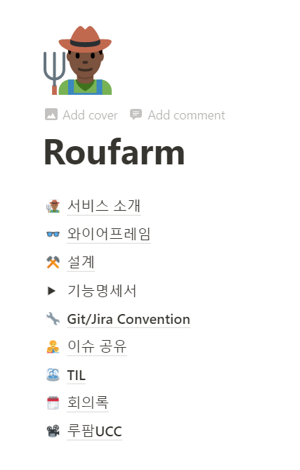

설계에 앞서 저희는 노션을 활용해서 모든 작업을 기록했습니다. (내용을 모두 공유할 수 없어 아쉽습니다ㅠ) 와이어프레임을 각각 그려서 서로에게 컨펌을 받았구요. 이를 바탕으로 기능명세서를 작성했습니다. API를 설계할 땐, 백엔드와의 소통을 통해 Response 구조를 함께 정의했습니다. 또한 저희는 이슈가 발생하면 어떤 이슈였는지, 그리고 이를 어떻게 해결했는 지 기록을 하였고 또 공유를 했습니다. 마지막으로 Git과 Jira의 Convention을 통해 Work flow를 진행했습니다. 


### [와이어프레임](https://www.figma.com/file/d3RaeUJgRCSFg2XqYLxmWs/%EC%9E%90%EC%9C%A8%ED%94%84%EB%A1%9C%EC%A0%9D%ED%8A%B8)

### 아키텍쳐

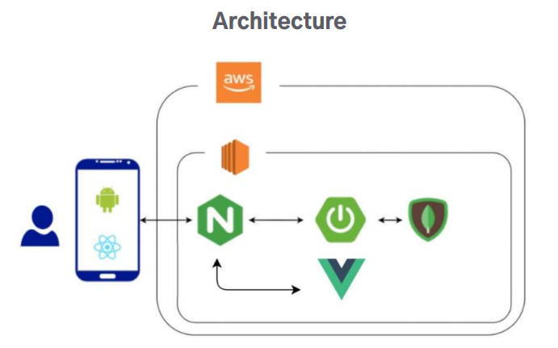

## 📌 주요기능

> 주요 기능들 중에서, 제가 주로 한 부분에 대해서 간략하게 정리를 할게요.


### 어플리케이션 소개 페이지

저희 서비스는 남들에게 카톡으로 자신의 습관 기록을 자랑할 수 있는데요. 다른 사람들이 이를 보고 자신도 습관을 만들어보고 싶다! 할 때 바로 이 소개 페이지로 넘어갈 수 있도록 해놨습니다. 그래서 Vue로 빠르게 만들고 보니 클라이언트에서 렌더링되다보니 `어플 소개 페이지가 제대로 검색되지 않겠다`라는 생각에 이르렀어요. (물론 초기엔 자랑하기 ➡ 소개 페이지 만 고려했지만요.) 그래서 현재 nuxt.js를 공부하여 `소개 페이지의 경우 SSR로` 바꾸고 있습니다. 

| 모바일                               | PC                       |
| ------------------------------------ | ------------------------ |
| 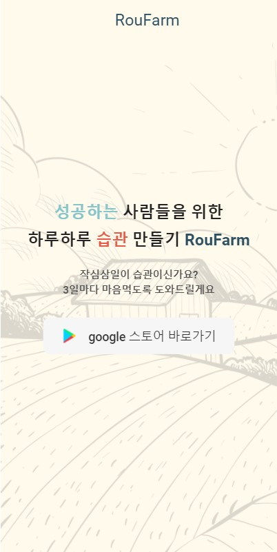 | 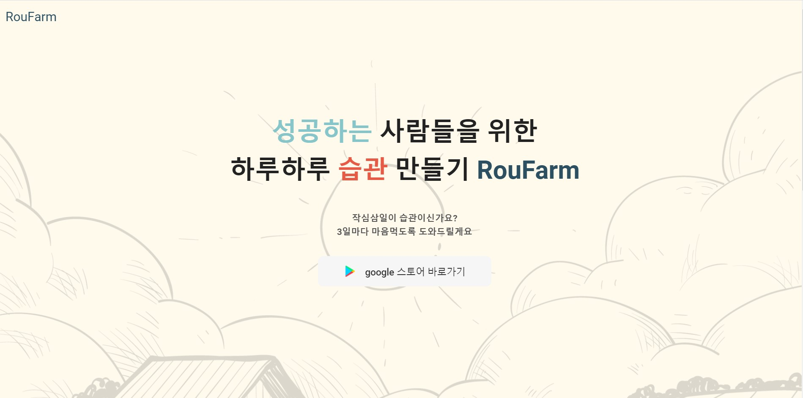 |
| 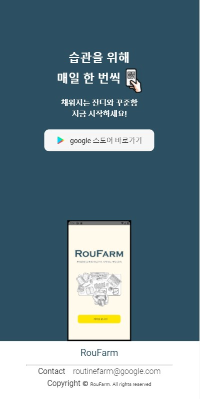     | 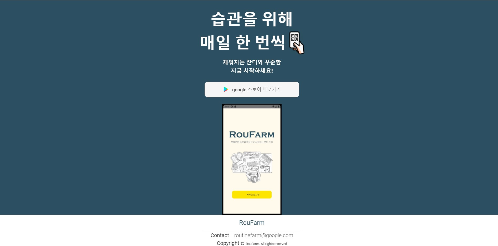 |

### 리포트 스크린

리포트 스크린은 사용자가 스스로 피드백을 할 수 있도록 루틴 로그 통계를 제공합니다.

따라서, 사용자가 어떤 통계자료를 보고 성공적인 습관을 만들어낼 수 있을 까를 고민했습니다. 그래서 월간 리포트에서는 `1.깃허브의 잔디처럼` 동기부여가 될 수 있는 기능을 넣었고, 또 `2.해쉬태그별 루틴을 통해 어떤 일을 더 많이 하는 지` 파악할 수 있도록 하였습니다. 주간 리포트에서는 `3.어떤 루틴을 많이 실패하는 지`, 그리고 `4. 어떤 요일에 내가 제대로 달성을 하지 않는 지` 보여주었습니다.###

#### 클릭시

|                            로딩중                            |                         로그 없을 시                         |
| :----------------------------------------------------------: | :----------------------------------------------------------: |
| 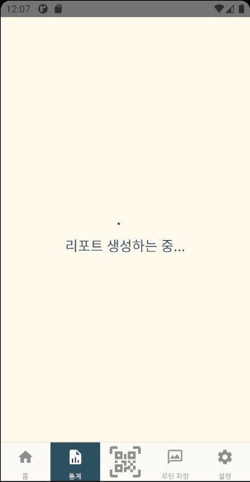 | 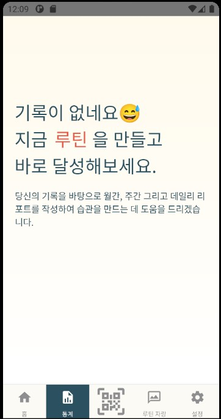 |


#### 월간

| 일일 달성률                         | 디테일                         | 해쉬태그별                         |
| ----------------------------------- | ------------------------------ | ---------------------------------- |
| 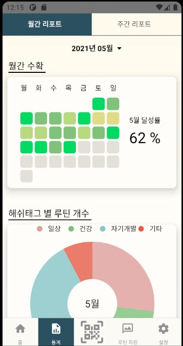 | 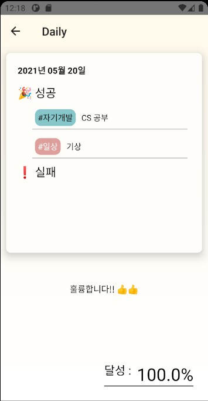 | 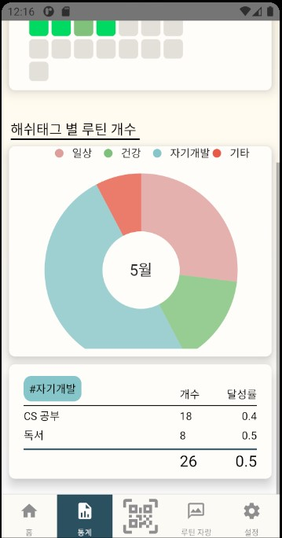 |

<span style="color:grey"> *잔디 클릭 시 일일 정보기록(디테일스크린)을 알 수 있습니다.</span>

<span style="color:grey"> *파이클릭시 해당 해쉬태그별 루틴을 알 수 있습니다.</span>


#### 주간

|                        요일별 달성률                         |                          실패리스트                          |
| :----------------------------------------------------------: | :----------------------------------------------------------: |
| 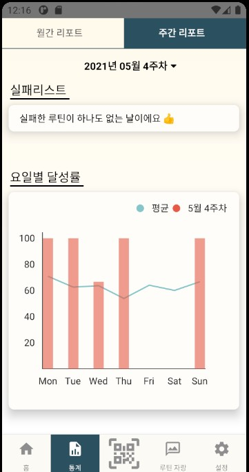 | 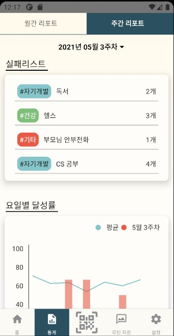 |


## 📌 setting

> 프로젝트 로컬 실행 기준

frontend(react native application)
client(Vue)
backend(Spring Boot)

1. frontend

   - 안드로이드 스튜디오

     [Window 개발환경 구축](https://dev-yakuza.posstree.com/ko/react-native/install-on-windows/)

     [mac OS 개발환경 구축](https://dev-yakuza.posstree.com/ko/react-native/install-on-mac/)

   ```bash
   # install
   $ npm install 
   
   # run application
   $ react-native run-android
   ```

2. client

   ```bash
   # install
   $ npm install
   
   # run application
   $ npm run serve
   ```

### release

- client: 카카오 공유하기 및 애플리케이션 소개 웹 페이지

  http://k4c105.p.ssafy.io/

- frontend: 안드로이드 애플리케이션

  [apk file download](https://drive.google.com/drive/folders/1k9VgP8AbFAEt9T0qVbGdzdsdixhIyuWG)


## 📌 RN build

> 안드로이드는 모든 앱이 설치전에 디지털 서명화가 되어있어야 한다.
>
> 따라서 릴리즈 키가 필요(구글 플레이에 등록할 때)

[공식문서](https://reactnative.dev/docs/signed-apk-android)

### 1. 업로드 키 생성

`~/android/app` 경로에서

```bash
$ keytool -genkeypair -v -storetype PKCS12 -keystore my-upload-key.keystore -alias my-key-alias -keyalg RSA -keysize 2048 -validity 10000
```

```
keystore password: ssafy1234
first name and last name: ssafy
organizational unit: ssafy
organization name: ssafy
City or Locality: GJ
State or Province: GJ
country code: KR
```

output

```
>> Generating 2,048 bit RSA key pair and self-signed certificate (SHA256withRSA) with a validity of 10,000 days
        for: CN=ssafy, OU=ssafy, O=ssafy, L=GJ, ST=GJ, C=KR
[Storing my-upload-key.keystore]
```


### 2. Gradle 변수 설정

1. `my-upload-key.keystore` 파일이 `android/app` 디렉토리에 위치하고 있는지 확인

2. `android/gradle.properties` 변수 추가

   ```properties
   # build 
   MYAPP_UPLOAD_STORE_FILE=my-upload-key.keystore
   MYAPP_UPLOAD_KEY_ALIAS=my-key-alias
   MYAPP_UPLOAD_STORE_PASSWORD=위에서 지정한 비밀번호
   MYAPP_UPLOAD_KEY_PASSWORD=위에서 지정한 비밀번호
   ```

   ```properties
   # build example
   MYAPP_UPLOAD_STORE_FILE=my-upload-key.keystore
   MYAPP_UPLOAD_KEY_ALIAS=my-key-alias
   MYAPP_UPLOAD_STORE_PASSWORD=ssafy1234
   MYAPP_UPLOAD_KEY_PASSWORD=ssafy1234
   ```

### 3.  `android/app/build.gradle`에 서명 경로 추가

```gradle
...
android {
    ...
    defaultConfig{...}
    // signing config 추가
    signingConfigs {
        release {
            if (project.hasProperty('MYAPP_UPLOAD_STORE_FILE')) {
                storeFile file(MYAPP_UPLOAD_STORE_FILE)
                storePassword MYAPP_UPLOAD_STORE_PASSWORD
                keyAlias MYAPP_UPLOAD_KEY_ALIAS
                keyPassword MYAPP_UPLOAD_KEY_PASSWORD
            }
        }
    }
    buildTypes {
        release {
            ...
            signingConfig signingConfigs.release
        }
    }
    // 여기까지
}
```

### 4. release AAB 생성

> AAB: Android App Bundle
>
> [설명자료](https://liapp.lockincomp.com/ko/blog/blog-Post/tech-google-android-app-bundle/)

```bash
$ cd android
# aab
$ ./gradlew bundleRelease

# apk
$ ./gradlew assembleRelease
```


#### 에러 발생

1. 3번 항목에서 `...` 빼주고 작동하니 일단 해결

2. `Task :app:mergeReleaseResources FAILED` 에러 발생

   > Resource and asset merger: Duplicate resources

=> darawble 파일들이 겹쳐서 발생하는 문제(겹치는 파일 확인 후 삭제)

3. `FAILURE: Build failed with an exception`에러 발생

   ```
   * What went wrong:
   Execution failed for task ':app:bundleReleaseResources'.
   > A failure occurred while executing com.android.build.gradle.internal.tasks.Workers$ActionFacade
      > Android resource linking failed
        C:\Users\qsoo\Desktop\.autonomy_pjt\code\frontend\android\app\build\intermediates\bundle_manifest\release\AndroidManifest.xml:37: AAPT: error: resource mipmap/ic_launcher (aka com.frontend:mip
   > ID
   ```

   => 매핑이 잘못되서 생기는 문제 같음 일단 `./gradlew clean` 실시

   => 아이콘과 스플래쉬 스크린이 없어져서 발생했던 문제 - 다시 생성해서 시도

4. splashscreenTheme 2번 선언되서 발생 - `android/app/src/main/res/values`에서 수정


### 5.  output 확인

`android/app/build/outputs/bundle/release/app.aab` (aab)

`android/app/build/outputs/apk/release/app-release.apk` (aab)

### 6. 빌드된 파일 테스트

```bash
$ react-native run-android --variant=release
```


## 에러 발생

> 릴리즈 버전에서 서버와 통신이 되지 않을 때

### 해결법

`android/app/src/main/AndroidManifest.xml` 파일에

```xml
manifest ...>
    <uses-permission android:name="android.permission.INTERNET" />
    <application
        ...
        android:usesCleartextTraffic="true"  // <-- added this !!!!
        ...>
        ...
    </application>
</manifest>
```

[참고자료](https://velog.io/@hyoungnamoh/%EC%B2%AB-%EA%B2%8C%EC%8B%9C%EA%B8%80)